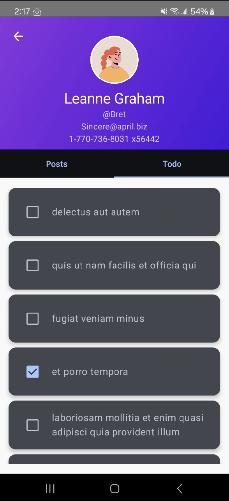

# HackerRank JSON User App

This project is an Android application built with Kotlin and Jetpack Compose that displays users, their posts, and to-do lists using data from [JSONPlaceholder](https://jsonplaceholder.typicode.com/). In addition, the app integrates with OpenAI’s API to determine the gender of a user (based on their name) and displays an appropriate avatar image (male or female).

---

## Features

- **User Listing:**  
  - Fetch and display a list of users from JSONPlaceholder.
  - Navigate from a home screen to a dedicated user list screen.

- **User Detail Screen:**  
  - Displays detailed user information such as name, username, email, and phone.
  - Shows two tabs: one for posts and one for to-do items.
  - Uses OpenAI’s API to check the user's name and determine gender; the profile image updates accordingly.

- **Posts Management:**  
  - Display posts related to the selected user.
  - Sort posts by title in ascending or descending order with a single sort button.
  - Edit posts via an edit dialog.
  - Delete posts using a three-dot options menu that shows “Edit” and “Delete” options.
  - A confirmation dialog appears before deleting a post.

- **To-Do List:**  
  - Display to-do items for the selected user.
  - Toggle to-do completion status interactively.

---

## Prerequisites

- **Android Studio:** Latest version recommended.
- **Kotlin:** Used for app development.
- **OpenAI API Key:**  
  - Sign up for an API key from [OpenAI](https://platform.openai.com/).
  - Replace the placeholder `YOUR_OPENAI_API_KEY_HERE` in the code with your actual API key.

---

## Dependencies

- **Jetpack Compose:** For building the UI.
- **Retrofit & OkHttp:** For making API calls to JSONPlaceholder and OpenAI.
- **Gson Converter:** For JSON parsing with Retrofit.
- **StateFlow & Coroutines:** For asynchronous data handling in ViewModels.

---

## Project Structure

- **data/**  
  Contains data models for User, Post, Todo, etc.
  
- **repository/**  
  Houses the repository classes for fetching users, posts, and to-dos.

- **ui/**  
  Contains Jetpack Compose UI components including screens such as `MainScreen`, `UserList`, and `UserDetailScreen`.

- **viewmodel/**  
  Contains ViewModels for managing UI-related data for Users, Posts, and ToDos.

- **openai/**  
  Contains Retrofit setup and functions for integrating with the OpenAI API to determine gender.

---

## Usage

1. **Home Screen:**  
   Tap the **Show Users** button to load the list of users.

2. **User List Screen:**  
   Browse through the list of users. Tap on a user to navigate to their detailed profile screen.

3. **User Detail Screen:**  
   The app automatically checks the user's name with OpenAI and displays the corresponding avatar.  
   Use the **Posts** tab to view, sort, edit, or delete posts.  
   Use the **Todo** tab to view and interact with to-do items.
